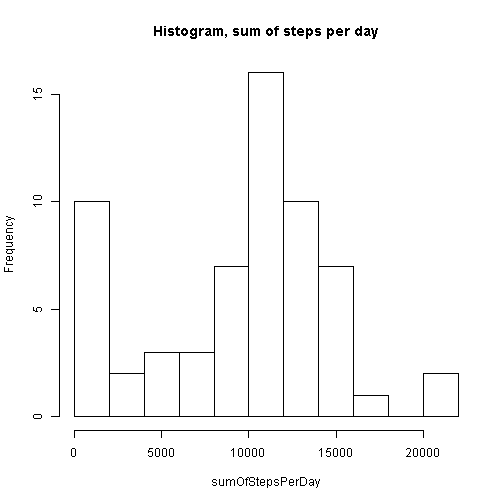
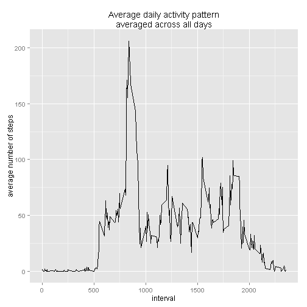
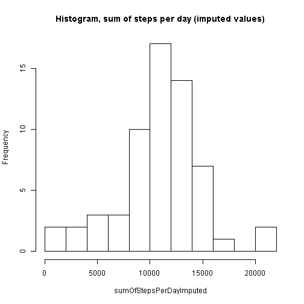
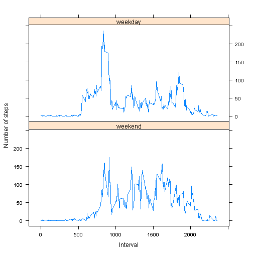

# Reproducible-Research

---
title: "PA1_template"
date: "Thursday, April 09, 2015"
output: html_document
---

# Introduction

It is now possible to collect a large amount of data about personal movement using activity monitoring devices such as a Fitbit, Nike Fuelband, or Jawbone Up. These type of devices are part of the "quantified self" movement - a group of enthusiasts who take measurements about themselves regularly to improve their health, to find patterns in their behavior, or because they are tech geeks. But these data remain under-utilized both because the raw data are hard to obtain and there is a lack of statistical methods and software for processing and interpreting the data.

This assignment makes use of data from a personal activity monitoring device. This device collects data at 5 minute intervals through out the day. The data consists of two months of data from an anonymous individual collected during the months of October and November, 2012 and include the number of steps taken in 5 minute intervals each day.

# Data

The data for this assignment can be downloaded from the course web site:

* Dataset: [Activity monitoring data](https://d396qusza40orc.cloudfront.net/repdata%2Fdata%2Factivity.zip) [52K]

The variables included in this dataset are:

* __steps__: Number of steps taking in a 5-minute interval (missing values are coded as NA)

* __date__: The date on which the measurement was taken in YYYY-MM-DD format

* __interval__: Identifier for the 5-minute interval in which measurement was taken

The dataset is stored in a comma-separated-value (CSV) file and there are a total of 17,568 observations in this dataset.

### Loading and preprocessing the data


```r
activityData <- read.csv(file = "C:/Users/Andreas/Dropbox/Coursera/Reproducible research/activity.csv")
activityData$date <- as.Date(activityData$date)
activityData$fdate <- factor(format(activityData$date, '%m-%d'))
options("scipen" = 10)
```

### What is the mean total number of steps taken per day?

Calculate the total number of steps per day, including the mean total number of steps per day and the median total number of steps per day. 


```r
sumOfStepsPerDay <- tapply(activityData$steps, activityData$fdate, function(x) sum(x, na.rm=TRUE)) 
hist(sumOfStepsPerDay, main = "Histogram, sum of steps per day", breaks=15)
```

 

```r
meanStepsPerDay <- mean(sumOfStepsPerDay)
medianSteps <- median(sumOfStepsPerDay)
```

The mean total number of steps per day is 

* __9354.2295082__.

The median total number of steps per day is 

* __10395__.

### What is the average daily activity pattern?

Make a time series plot of the 5-minute interval and the average number of steps taken, averaged across all days. 


```r
library(plyr)
library(ggplot2)
activityTimeSeries <- ddply(activityData, .(interval), summarise, meanStepsPerInterval = (mean(steps, na.rm=TRUE)))

ggplot(activityTimeSeries, aes(x = interval, y = meanStepsPerInterval)) +
        geom_line(lwd = 0.1) +
        ggtitle("Average daily activity pattern\naveraged across all days") +
        ylab("average number of steps")
```

 

Which interval (averaged across all days) contains the maxmium number of steps?


```r
intervalWithMaximumNumberOfSteps <- head(activityTimeSeries[order(activityTimeSeries$meanStepsPerInterval, 
                                                                  decreasing=TRUE),],1)
intervalWithMaximumNumberOfSteps <- intervalWithMaximumNumberOfSteps[[1]]
```

The interval that contains the maximum number of steps is

* interval number __835__

### Imputing missing values

Note that there are a number of days/intervals where there are missing values (coded as `NA`). The presence of missing days may introduce bias into some calculations or summaries of the data. 

1. Calculate and report the total number of missing values in the dataset (i.e. the total number of rows with NAs): 


```r
sum(is.na(activityData$steps))
```

```
## [1] 2304
```

2. Devise a strategy for filling in all of the missing values in the dataset. The strategy does not need to be sophisticated. For example, you could use the mean/median for that day, or the mean for that 5-minute interval, etc.

* _I have decided to fill in the missing values with the mean value for the interval in question averaged across the same day. In other words, a missing value for interval 200 on a Thursday would be replaced with the average value for interval 200 averaged across all Thursdays in the dataset_ 


```r
activityData$days <- factor(format(activityData$date, '%A')) # a factor variable denoting the full name of the day
imputedData <- ddply(activityData, .(days, interval), transform, imputedSteps = mean(steps, na.rm=TRUE))
imputedData$stepsImputed <- with(imputedData, ifelse(is.na(steps)==TRUE, imputedSteps, steps))
imputedData <- imputedData[, c(2, 3, 4, 5, 7)] # removing the temporary variables
colnames(imputedData)[5] <- "steps" # renaming the steps-variable for convenience
```

3. Make a histogram of the total number of steps taken each day and calculate and report the mean and median total number of steps taken per day. Do these values differ from the estimates from the first part of the assignment? What is the impact of imputing missing data on the estimates of the total daily number of steps?


```r
sumOfStepsPerDayImputed <- tapply(imputedData$steps, imputedData$fdate, function(x) sum(x, na.rm=TRUE)) 
hist(sumOfStepsPerDayImputed, main = "Histogram, sum of steps per day (imputed values)", breaks=15)
```

 

```r
meanStepsPerDayImputed <- mean(sumOfStepsPerDayImputed)
medianStepsImputed <- median(sumOfStepsPerDayImputed)
diffMean <- meanStepsPerDay-meanStepsPerDayImputed
diffMedian <- medianSteps-medianStepsImputed
```

The mean total number of steps per day estimated with the dataset with the imputed values is __10821.2096019__.
The median total number of steps per day estimated with the dataset with the imputed values is __11015__

The difference in means is __-1466.9800937__. 
The difference in medians is __-620__. 

* _The values of the mean and the median do differ between the datasets. Both the mean and the median is higher in the data set with the imputed steps variable._

* _The impact of imputing the missing data on the estimates of the total daily number of steps is an increase in the estimated total daily number of steps. In other words, we might overestimate when using the dataset with the imputed values and we might underestimate otherwise._

### Are there differences in activity patterns between weekdays and weekends?

Use the dataset with the filled-in missing values for this part.

1. Create a new factor variable denoting whether or not the day is a weekday or a weekend.

```r
imputedData$daysDummy <- factor(with(imputedData, ifelse(days %in% c("l�rdag", "s�ndag"), 
                                                         "weekend", "weekday")), 
                                levels = c("weekend", "weekday"), ordered=TRUE) 
```

2. Make a panel plot containing a time series plot (i.e. `type = "l"`) of the 5-minute interval (x-axis) and the average number of steps taken, averaged across all weekday days or weekend days (y-axis). 


```r
library(lattice)
activityWeek <- ddply(imputedData, .(interval, daysDummy), 
                          summarise, steps = mean(steps, na.rm=TRUE))

xyplot(steps ~ interval| daysDummy, 
           data = activityWeek,
           type = "l",
           xlab = "Interval",
           ylab = "Number of steps",
           layout=c(1,2))
```

 

